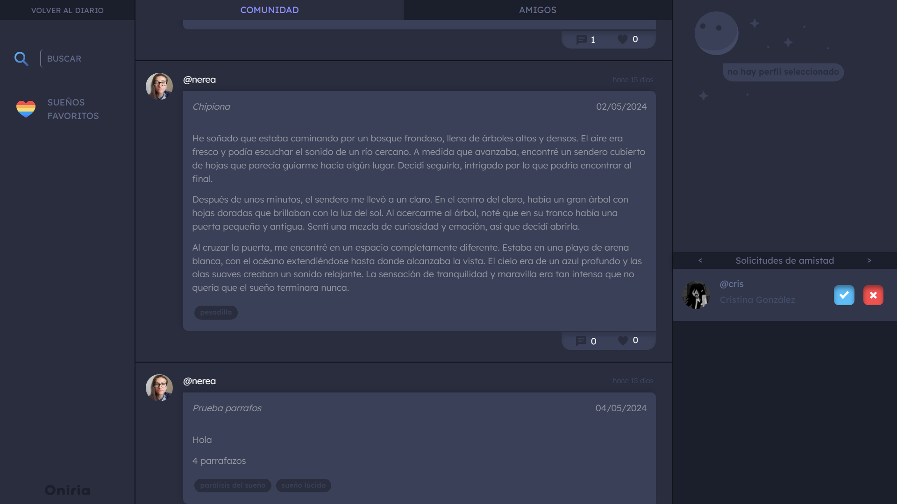

# 🌙 Oniria - Dream Journal Web App 

### [English](#english-version) | [Español](#versión-en-español)

## Versión en Español

## 📖 Descripción del Proyecto

**Oniria** es una aplicación web diseñada para ser un diario de sueños personal. Los usuarios pueden registrar sus sueños, etiquetarlos, listar a las personas involucradas y visualizar gráficos sobre sus tipos de sueños a lo largo del tiempo.

Además, la plataforma permite compartir los sueños de manera pública a través de un perfil, actuando como un foro o red social temática donde otros usuarios pueden interactuar mediante comentarios, likes y otras acciones.

### 🚀 Características clave:
- **Diario de sueños** privado y seguro para cada usuario.
- Posibilidad de **compartir sueños** públicamente.
- Interacciones sociales: comentarios, likes, y guardar publicaciones.
- Gráficos interactivos que muestran tendencias en los tipos de sueños.
- Sistema de etiquetas para organizar los sueños.
- Gestión de relaciones de amistad entre usuarios.

## 🛠️ Tecnologías Utilizadas

### Frontend:
- **Angular 16**: para la estructura reactiva de la UI.
- **HTML, CSS, Bootstrap**: para estilizar la interfaz y crear una experiencia atractiva y responsiva.
- **Librerías Angular**:
  - **ngx-cookie-service**: para el manejo de cookies y autenticación.
  - **notyf**: para mostrar notificaciones estilo toast.
  - **chart.js**: para los gráficos interactivos de tendencias y distribuciones de sueños.
  - **moment y date-fns**: para el manejo de fechas.

### Backend:
- **Django REST Framework**: desarrollo de la API RESTful.
- **PostgreSQL 15**: como sistema de gestión de bases de datos.
- **PGAdmin**: para la administración de la base de datos.
- **Bibliotecas de Django**:
  - **djangorestframework**: para crear una API escalable.
  - **django-friendship**: para gestionar las relaciones de amistad.
  - **django-allauth**: para autenticación y registro de usuarios.

### Estilización y Animaciones:
- **uiverse.io**: recursos y animaciones en CSS proporcionados por la comunidad.

## 📊 Arquitectura del Proyecto

### Capa de Datos (Modelo):
- **PostgreSQL 15** se ha utilizado como base de datos para almacenar los sueños registrados y los datos del perfil de usuario.

### Capa de Presentación (Vista):
- El frontend se ha desarrollado utilizando **Angular 16**, acompañado de **HTML, CSS** y **Bootstrap**. Además, las librerías **ngx-cookie-service**, **notyf**, **chart.js** y **moment** se han integrado para mejorar la funcionalidad y la experiencia de usuario.

### Capa de Lógica de Negocio (Controlador):
- La lógica de negocio se implementa mediante una **API RESTful** desarrollada con **Django REST Framework**, gestionando todas las operaciones CRUD (Crear, Leer, Actualizar, Eliminar) relacionadas con los sueños de los usuarios, así como la autenticación y autorización.

## 🎨 Visualizaciones y Funcionalidades Extra
Los gráficos de tendencias y distribuciones de los tipos de sueños se han implementado usando **chart.js**, proporcionando una visualización clara y atractiva del comportamiento de los sueños a lo largo del tiempo.

## 📂 Estructura del Repositorio
```bash
oniria/
├── frontend/              # Código del frontend (Angular 16)
├── backend/               # Código del backend (Django)
├── README.md              # Documentación del proyecto
└── ...
```

### 📸 Capturas de Pantalla:


---


---


---


---


---



---


---

## English Version


## 📖 Project Description

**Oniria** is a web application designed to serve as a personal dream journal. Users can record their dreams, tag them, list involved people, and view graphs showing dream patterns and types over time.

Additionally, dreams can be optionally shared publicly via a user profile, turning the platform into a forum or social network around dream-related themes, allowing other users to interact through comments, likes, and more.

### 🚀 Key Features:
- **Private dream journal** for each user.
- Option to share dreams publicly.
- Social interactions: comments, likes, and save posts.
- Interactive charts to visualize dream trends.
- Tag system to organize dreams.
- Friendship relationship management between users.

## 🛠️ Technologies Used

### Frontend:
- **Angular 16**: for the reactive UI structure.
- **HTML, CSS, Bootstrap**: to style the interface, creating an attractive and responsive experience.
- **Angular Libraries**:
  - **ngx-cookie-service**: to manage cookies and authentication.
  - **notyf**: for toast-style notifications.
  - **chart.js**: for interactive graphs displaying dream trends and distributions.
  - **moment and date-fns**: for handling dates.

### Backend:
- **Django REST Framework**: for building the RESTful API.
- **PostgreSQL 15**: as the database management system.
- **PGAdmin**: for database administration.
- **Django Libraries**:
  - **djangorestframework**: to build a scalable API.
  - **django-friendship**: to manage user friendships.
  - **django-allauth**: for authentication and user registration.

### Design and Animations:
- **uiverse.io**: community-provided CSS animations and resources.

## 📊 Project Architecture

### Data Layer (Model):
- **PostgreSQL 15** was used as the database to store user-recorded dreams and profile data.

### Presentation Layer (View):
- The frontend was developed using **Angular 16**, along with **HTML, CSS**, and **Bootstrap**. Libraries like **ngx-cookie-service**, **notyf**, **chart.js**, and **moment** were integrated to enhance functionality and user experience.

### Business Logic Layer (Controller):
- Business logic is implemented through a **RESTful API** built with **Django REST Framework**, handling all CRUD operations related to users' dreams, as well as user authentication and authorization.

## 📊 Visualizations and Additional Features
Charts for tracking dream trends and distributions were implemented using **chart.js**, providing clear and attractive visualization of dream patterns over time.

## 📂 Repository Structure
```bash
oniria/
├── frontend/              # Frontend code (Angular 16)
├── backend/               # Backend code (Django)
├── README.md              # Project documentation
└── ...
```

### 📸 Screenshots:


---


---


---


---


---


---


